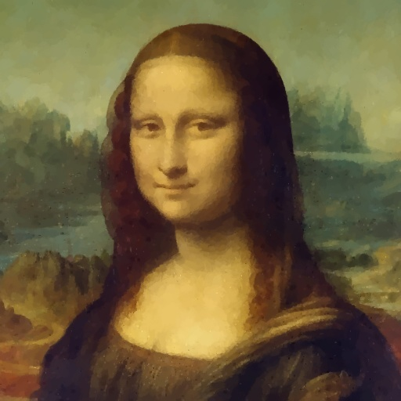

<h1 align="center">
    Genetic Artist
</h1>

<h4 align="center">
    Automagically redraw any image into a painting by means of artificial evolution.
</h4>

<p align="center">
    <a href="#key-features">Key Features</a> •
    <a href="#how-to-use">How to Use</a> •
    <a href="#try-it-out">Try it Out!</a> •
    <a href="#acknowledgements">Acknowledgements</a> •
    <a href="#license">License</a>
</p>

##  Key Features

* **Recreate any image through genetic algorithms**: _Genetic Artist_ uses genetic algorithms to recreate images by painting brushstrokes, resulting in unique and stunning artwork.
* **Customize the stroke library for any art style**: You can provide a folder of stroke images for the program to use. Experiment with known art styles or create your own unique mixes.
* **Don't start on a blank canvas**: The starting canvas image can be customized to help the artist recreate the image faster or experiment with the output.
* **Watch the creative process in action**: A window opens by default, allowing you to watch the artist at work and see the progress brushstroke by brushstroke.
* **Free and open-source!**: Every part of the _Genetic Artist_ is accessible for you to experiment and tinker with. Don't be shy and contribute all you want!
* **Run on any platform**: _Genetic Artist_ is cross-platform and easy to run on any machine, whether it be Windows, macOS or Linux.

## How to Use

To run this program you will need [Python 3](https://www.python.org) with [pip](https://pypi.org/project/pip) installed.

1. Clone this repository or [download](https://github.com/ahmedfgad/GeneticArtist/archive/refs/heads/main.zip) it instead:

```shell
git clone https://github.com/Tikitikitikidesuka/GeneticArtist.git
```

2. Go into the repository directory:

 ```shell
 cd GeneticArtist
 ```

3. Install the project's dependencies:

```shell
pip install -r requirements.txt
```

4. Run the artist:

```shell
python src/main.py --target <Target Image> \
                   --strokes <Stroke Directory> \
                   --config <Config File> \
                   --iterations <Number of Strokes To Draw> \
                   --output <Ouptut Image>
```

To get a detailed output of what the program is doing add `--verbose` to the parameters.

To hide the preview window add `--nogui` to the parameters.
In case you do want it, remember to press ESC to close it when the program is done.

> **Note**
> 
> The GUI is still a prototype and will be changed shortly

## Try it Out!

Ready to see the magic happen? Check out some examples of what you can create with _Genetic Artist_.

Example strokes, target images, and canvases are provided in the repository, so you can try out the program right away.
Here are a few examples to get you started:

### Night Sky

To create a painting of the night sky, navigate to the project folder and run the following command:

```shell
python src/main.py --target examples/targets/moon.jpg \
                   --strokes examples/strokes/ \
                   --canvas examples/canvases/white.jpg \
                   --config examples/configs/medium_quality.toml \
                   --iterations 256 \
                   --output outputs/my_moon256.png \
                   --verbose
```

This will produce a beautiful painting like the one shown below:


### Lake Landscape

If you prefer a peaceful lake landscape, run this command instead:

```shell
python src/main.py --target examples/targets/lake.jpg \
                   --strokes examples/strokes/ \
                   --canvas examples/canvases/black.jpg \
                   --config examples/configs/high_quality.toml \
                   --iterations 256 \
                   --output outputs/my_lake256.png \
                   --verbose
```

The result will look something like this:


## Monaliza

Use a canvas of the same size as the image. The used Monaliza image size is `512x512` and so the canvas size. Use this [online tool](https://www12.lunapic.com/editor/?action=blank) to create blank images.

```shell
python src/main.py --target examples/targets/monaliza.jpg ^
                   --strokes examples/strokes/ ^
                   --canvas examples/canvases/white512.jpg ^
                   --config examples/configs/high_quality.toml ^
                   --iterations 6500 ^
                   --output outputs/monaliza.png ^
                   --verbose
```

This is the output.




Feel free to experiment with different target images, strokes, and canvases to see what unique creations you can come up with!

## Acknowledgements

This project wouldn't be possible without the following open source packages:

* **[PyGAD](https://pygad.readthedocs.io/en/latest/)** to power the image recreation process in our program.
* **[OpenCV](https://opencv.org/)** and **[Numpy](https://numpy.org/)** to handle the image processing and manipulation tasks. Make sure to install [OpenCV-Contrib](https://pypi.org/project/opencv-contrib-python).
* **[Numba](https://numba.pydata.org/)** to accelerate the custom image processing functions.

The example images are provided by [Pixabay](https://pixabay.com/):

* [lake.jpg](https://pixabay.com/photos/landscape-nature-forest-sunset-4855256) image by [Joe](https://pixabay.com/users/jplenio-7645255) from Pixabay.
* [moon.jpg](https://pixabay.com/fr/photos/lac-le-coucher-du-soleil-for%C3%AAt-7644166/) image by [jplenio](https://pixabay.com/fr/users/jplenio-7645255) from Pixabay.
* [landscape.jpg](https://pixabay.com/photos/lake-nature-travel-exploration-6701636) image by [ELG21](https://pixabay.com/users/elg21-3764790/) from Pixabay.
* [maldives.jpg](https://pixabay.com/photos/landscape-ocean-beach-sunset-4354117) image by [ELG21](https://pixabay.com/users/elg21-3764790/) from Pixabay.

This is in addition to the Monaliza image.

## License

_Genetic Artist_ is distributed under the MIT License. See [`LICENSE.md`](https://github.com/Tikitikitikidesuka/GeneticArtist/blob/168171a1d6d329c7f488cee31380a57f945ed343/LICENSE.md) for more information.
